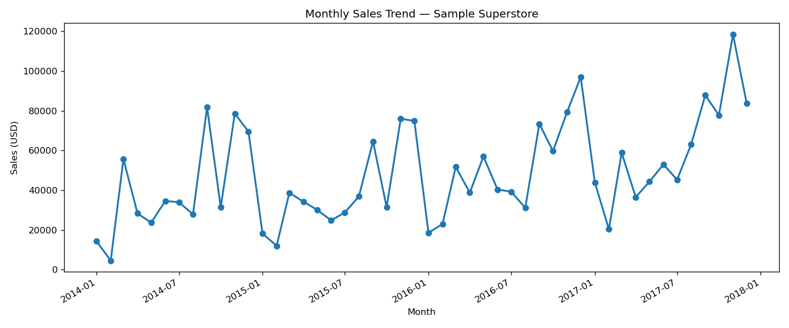
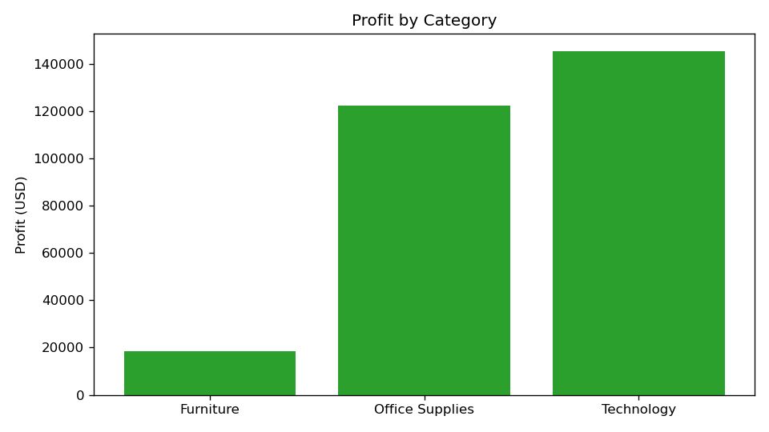
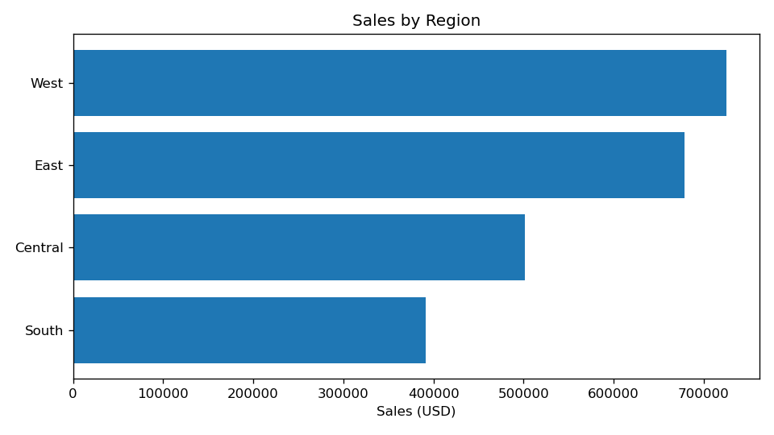

# Sales Analysis — Sample Superstore

End-to-end sales analysis of a retail superstore dataset: data cleaning with pandas,
KPI reporting (overall + year-wise), breakdowns by category, region and segment,
a monthly sales trend, and top/bottom-10 products by profit. Every number below
was computed directly from the dataset — no placeholders.

## Dataset

- **Sample Superstore** — 9,994 orders across 2014–2017, 21 columns
  (Order Date, Ship Date, Sales, Profit, Category, Sub-Category, Region,
  Segment, Product Name, Quantity, Discount, …).
- Source: ["Superstore Dataset" by Vivek Chowdhury on Kaggle](https://www.kaggle.com/datasets/vivek468/superstore-dataset-final)
- The CSV is included at `data/sample_superstore.csv` (original file, unmodified).
  If you prefer to download it yourself, grab it from the Kaggle link above and
  drop it into `data/`.

## How to run

```bash
pip install -r requirements.txt
python sales_analysis.py
```

The script prints KPIs, breakdowns and insights to the console and saves three
charts under `charts/`.

## Key findings

1. **$2,297,201 in sales, $286,397 profit (12.5% margin)** across 5,009 orders
   from 2014 to 2017. Sales grew every year: $484,248 (2014) → $733,215 (2017).
2. **Technology is the profit engine** — $145,455 profit at a 17.4% margin —
   while **Furniture is the margin drag** at just 2.5% ($18,451 profit on
   $741,999 of sales).
3. **The West region leads** with $725,458 in sales (14.9% margin); the South is
   smallest at $391,722. The Consumer segment drives $1,161,401 of sales.
4. **1 in 5 orders loses money** — 1,022 of 5,009 orders (20.4%) were
   loss-making in total, with a negative discount–profit correlation (−0.22):
   heavy discounting is eating margin.
5. **November 2017 was the peak month** ($118,448 sales — strong Q4 seasonality).
   The best product, *Canon imageCLASS 2200 Advanced Copier*, earned $25,200;
   the worst, *Cubify CubeX 3D Printer Double Head Print*, lost −$8,880.

## Charts







## Project structure

```
.
├── sales_analysis.py      # full analysis pipeline (pandas + matplotlib)
├── requirements.txt
├── data/
│   └── sample_superstore.csv
├── charts/                # generated charts (monthly trend, category profit, region sales)
└── LICENSE
```

## Tech

Python 3 · pandas · matplotlib
